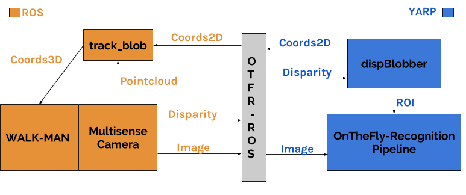

# OTFR_ROS
Bridge module to provide bidirectional communication between Walk-Man and the OnTheFlyRecognition Modules, as can be seen in the following diagram:



## Description
The `OTFR_ROS` module provides format conversion between ROS and YARP to allow the use of the OnTheFlyRecognition pipeline with the WALK-MAN robot. 
In particular, it transforms disparity and left camera images from ROS to YARP, and the blob coordinates returned by dispBlobber from YARP to ROS. 

Tracking, i.e., command the WALK-MAN's gaze to follow the closest object, is provided by the [walkman_gaze](./walkman_gaze) ROS package.
To that end, `track_blob` performs the following steps:

1. Read the 2D pixel coordinates of the closest blob returned by `dispBlobber` (and coverted to ROS by OTFR_ROS).

2. Extract the 3D coordinates corresponding to that pixel from the pointcloud information provided by WALK-MAN's camera

3. Transform the computed 3D coordinates from the camera frame to the base reference frame of the robot (Waist).

4. Format and send those coordinates as a Gaze task to OpenSoT.


## Installation

The `OTFR_ROS` module should be installed together with the OnTheFlyRecognition installation. 
If needed, can also be installed independently using the standard installation pipeline in Linux: 
In Linux systems code can be compiled as follows:
```
git clone https://github.com/robotology/onthefly-recognition.git onthefly
cd onthefly/OTFR_ROS
mkdir build & cd build
ccmake ../
make install
```

If there are missing ROS messages defintions, YARP can generate the required files with the following command: 

`yarpidl_rosmsg <msg_tpye>`

eg: 

`yarpidl_rosmsg sensor_msgs/Image`

The `walkman_gaze` node can be installed using the standard ROS package installation tools with catkin_make: 

http://wiki.ros.org/ROS/Tutorials/CreatingPackage

With the name `walkman_gaze`, and the following dependencies: 
```
roscpp
rospy
tf
pcl_conversions
pcl_ros
sensor_msgs
geometry_msgs
```

Or in a nutshell, calling the following command from the <ROS_WS>/src folder: 

`catkin_create_pkg walkman_gaze roscpp rospy tf pcl_conversions pcl_ros sensor_msgs geometry_msgs`

Copy the file [walkman_gaze/src/track_blob.cpp](./tree/master/walkman_gaze/src/track_blob.cpp) inside the src folder of the created package.

Compile with `catkin_make` on the base ROS_WS path.

## Configure Multisense camera

Install the camera drivers as indicated on the [camera documentation](https://support.carnegierobotics.com/hc/en-us/article_attachments/200822158/MultiSense-SL_ROS_Driver_v3.1.pdf)

Connect the camera:
* Plug it in!
* Use the network settings to add a new ethernet connection and set the following parameters:
  * `mtu = 7200`
  * `Ip = 10.66.171.20`

* Launch the camera:
  `roslaunch multisense_bringup multisense.launch`

Check the images are being read ok in ROS:

`rosrun image_view image_view image:=/multisense/left/image_rect_color`

`rosrun image_view image_view image:=/multisense/depth`

Check that YARP conversion is wokring too:

* Open viewer on topic reading mode with yarp format: `/topic@/node` eg:

`yarpview --name /multisense/left/image_rect_color@/viewer`

## Run OTFR on Multisense camera (without WALK-MAN)

1. Make sure that ROS and ROS enabled YARP are running:
```
roscore
yarpserver --ros 
```
(and check for the yarpclock error: if it appears, unset $YARP_CLOCK on .bashrc. )

2. Open application `OTFR_ROS_APP` on yarpmanager

  * Start all modules and connect them.

3. Use the standardt OTFR training pipeline:

  * Open rpc:
  
    `yarp rpc /onTheFlyRecognition/human:io`

    `>> train <object>`  while showing an object to the robot.


## Run OTFR on WALK-MAN (or on simulation)

1. Make sure that ROS and ROS enabled YARP are running:
```
roscore
yarpserver --ros 
```

2. Run WALK-MAN Gazebo simulation

`gazeborosyarp`

  1. Load IIT Bigman:

    *insert -> IIT Bigman*

  2. Run necessary services to connect YARP-XBot-ROS
    
    `CommunicationHandler <PATH_TO_ADVR>/configs/WALKMAN_shared/bigman/configs/config_walkman.yaml`
    
    `NRTDeployer <PATH_TO_ADVR>/configs/WALKMAN_shared/bigman/configs/config_walkman_nrt.yaml`
    
     `rosservice call /HomingExample_switch 1` << Starts the Homing service.
     
     `rosservice call /OpenSotIk_switch 1`  << Performs inverse kinematics based on a Stack of Tasks paradigm
     
     `rosservice call /IkRosSMPub_switch 1` << Interfaces ROS and the WALK-MAN system.
     
3. Open application `OTFR_ROS_APP` on yarpmanager

  * Start all modules and connect them.

4. Run the `track_blob` module:

  `rosrun walkman_gaze track_blob
  
  This will make the WALK-MAN robot look in the direction of the closest blob. 

5. Use the standardt OTFR training pipeline:

  * Open rpc:
  
    `yarp rpc /onTheFlyRecognition/human:io`

    `>> train <object>`  while showing an object to the robot.
    
